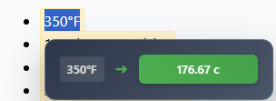

<div align="center">
<div align="center" style="display: flex;"> 
<h1 style="text-align: center;">  Universal Unit Converter - Chrome Extension </h1>
</div>

[](tests/TESTING.md)
[](package.json)
[](manifest.json)


**Instantly convert any unit measurement by simply selecting text on any webpage!**<br>
A powerful Chrome Extension that automatically detects and converts units in selected text, supporting length, weight, temperature, volume, and area measurements with smart auto-sizing and mixed-dimension support.


</div>


## ✨ Key Features

- 🎯 **Text Selection Conversion** - Select any measurement, get instant popup results
- 📏 **50+ Unit Types** - Length, weight, temperature, volume, area
- 🔧 **Smart Auto-Sizing** - Automatically chooses appropriate units (0.001m → 1mm)  
- 📐 **Dimension Support** - Handles complex formats like "8ft × 4ft × 30in"
- 🌐 **Unicode Compatible** - Recognizes symbols like cm², m², °C
- ⚡ **Non-Intrusive** - uses a popup to avoid modifying the original text
- ⚙️ **Auto-Save Settings** - Metric/Imperial presets with manual overrides

## 🚀 Quick Start

1. **Clone** this repository
2. **Open** `chrome://extensions/` in Chrome
3. **Enable** "Developer mode" (top right toggle)
4. **Click** "Load unpacked" and select the project folder
5. **Test** by selecting "30 cm" on any webpage → See "11.81 inches" popup!

## 💡 Usage Examples

| Select This | Get This Result |
|-------------|----------------|
| `30 cm` | `11.81 inches` |
| `100°F` | `37.78°C` |
| `5 kg` | `11.02 lbs` |
| `8ft × 4ft` | `2.44m × 1.22m` |
| `50 m²` | `538.2 ft²` |

## 🧪 Testing & Development

For  testing documentation, build instructions, and development setup:

**→ [See TESTING.md](tests/TESTING.md)**

**Quick Commands:**
```bash
npm test          # Run all 24 automated tests
npm run validate  # Validate extension structure  
npm run build     # Build for distribution
```

## 📁 Project Structure

```
unitConverter/
├── manifest.json              # Extension configuration
├── popup/                     # Settings UI
├── data/                      # Conversion data & patterns
├── utils/                     # Core conversion logic
├── tests/                     # test suite
├── .github/workflows/         # CI/CD automation
└── icons/                     # Extension icons
```

## 🔒 Privacy & Security

- **Minimal Permissions**: Only `activeTab` and `storage`
- **No External Servers**: All processing happens locally
- **No Data Collection**: Zero tracking or analytics
- **Offline Functionality**: Works without internet connection

## 🤝 Contributing

1. Fork this repository
2. Create a feature branch
3. Make your changes and test thoroughly
4. Submit a pull request

See [TESTING.md](tests/TESTING.md) for development guidelines and testing procedures.

## Credits

This project includes code from [Currency-Converter](https://github.com/adampawelczyk/Currency-Converter) by Adam Pawełczyk, licensed under the MIT License.

## 📄 License

MIT License - Feel free to use, modify, and distribute.
